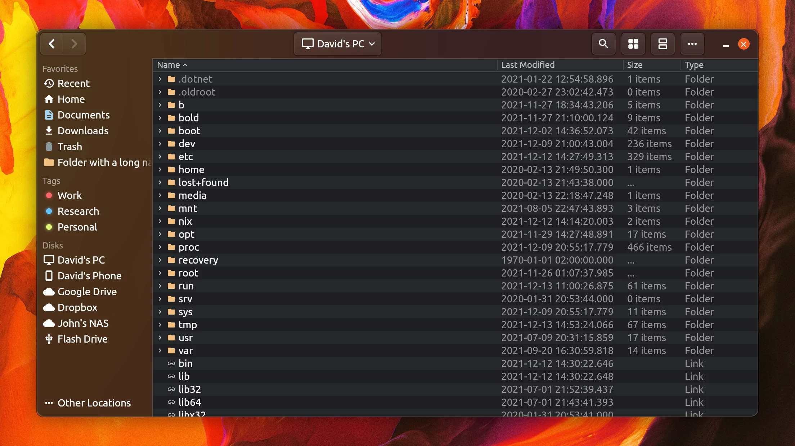
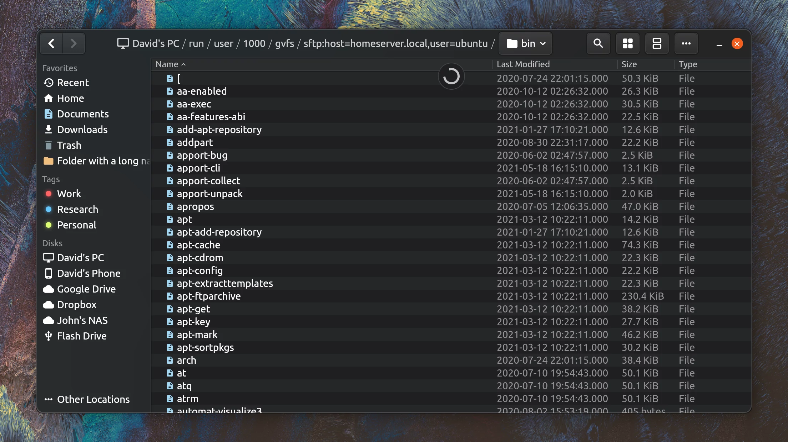
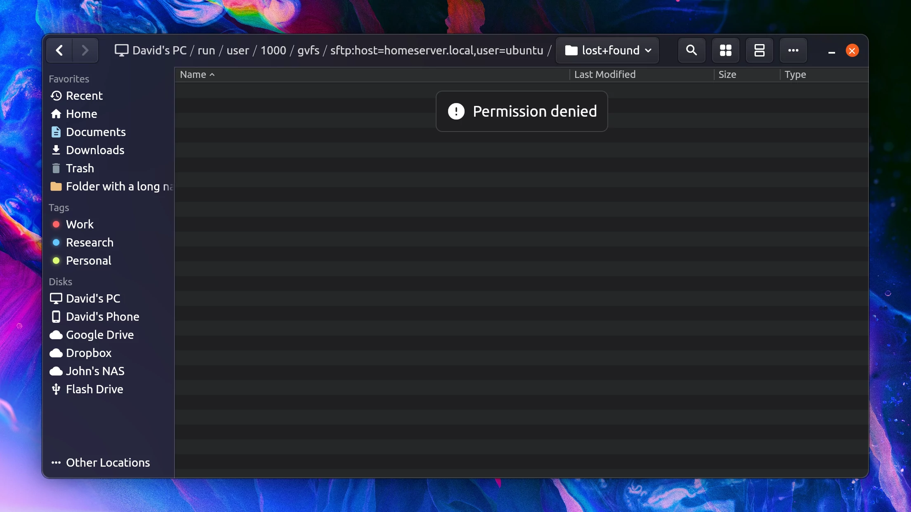

# RT File Manager (Acronym tbd)

Linux file manager with inspiration from GNOME Files and MacOS's Finder

Everything is WIP, most features missing!

Made in flutter with mostly custom widgets

## Screenshots

Interface subtly takes color from wallpaper, like Windows 11's Mica

Slow locations (such as remote disks) show a spinner and show the partial results while loading

Various I/O Errors show as a persistent bar on top of the file listing

## Ideas

- [ ] Transparent archives
- [x] Spinners while directory is loading
- [ ] Nearby share integration
- [ ] MacOS style Proxies
- [ ] Search vs Filter (just type = Filter in current directory + startswith ranked higher, Ctrl+F = Search recursively)
- [ ] Keyboard only nav
- [ ] Grouping like MacOS / Explorer
- [ ] New Nautilus style pathbar
    - [ ] Clicking slashes triggers Ctrl+L
    - [x] Clicking directory navigates
- [ ] Command pallete
- [ ] Status bar
- [ ] Home screen with recent files, favorites, disks, etc.
    - [ ] PC Info (hostname, etc?)
- [ ] File history (btrfs? custom snapshots?)
- [ ] Rightclick -> Share (SMB, SFTP, Mail, Phone, )
- [ ] MacOS like "Services", e.g. encode video, make qr code, etc.
- [ ] Storage used indicator for disks
- [x] Greyed out but persistent extensions
- [ ] Search/Smart folders (used for tags)
- [ ] Devices (KDE Connect integration)
- [ ] Tags
